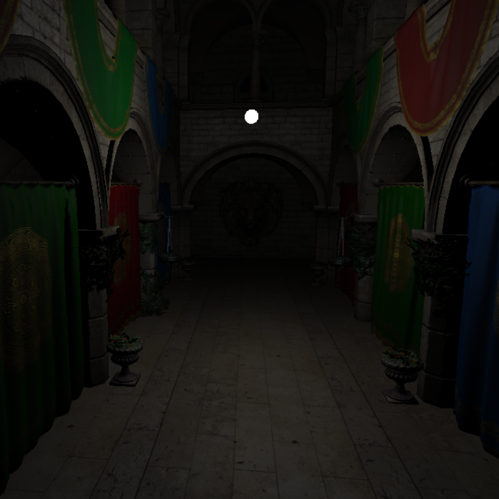
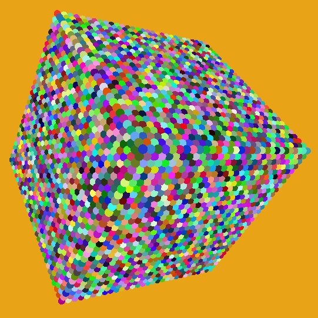
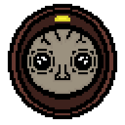
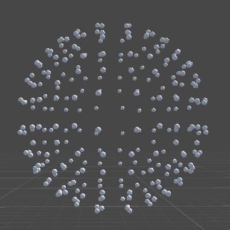
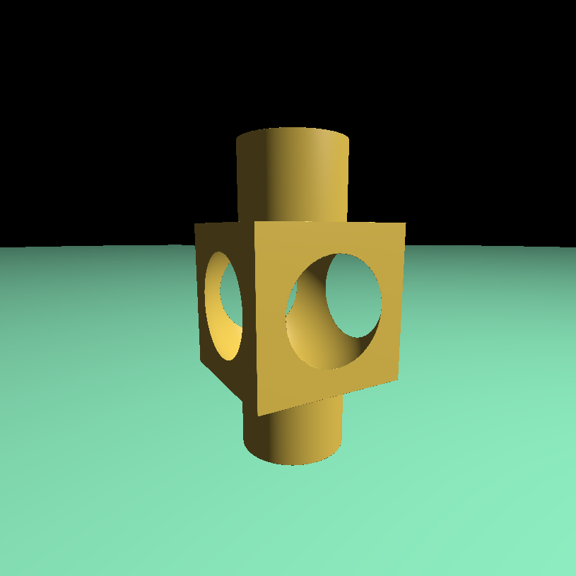
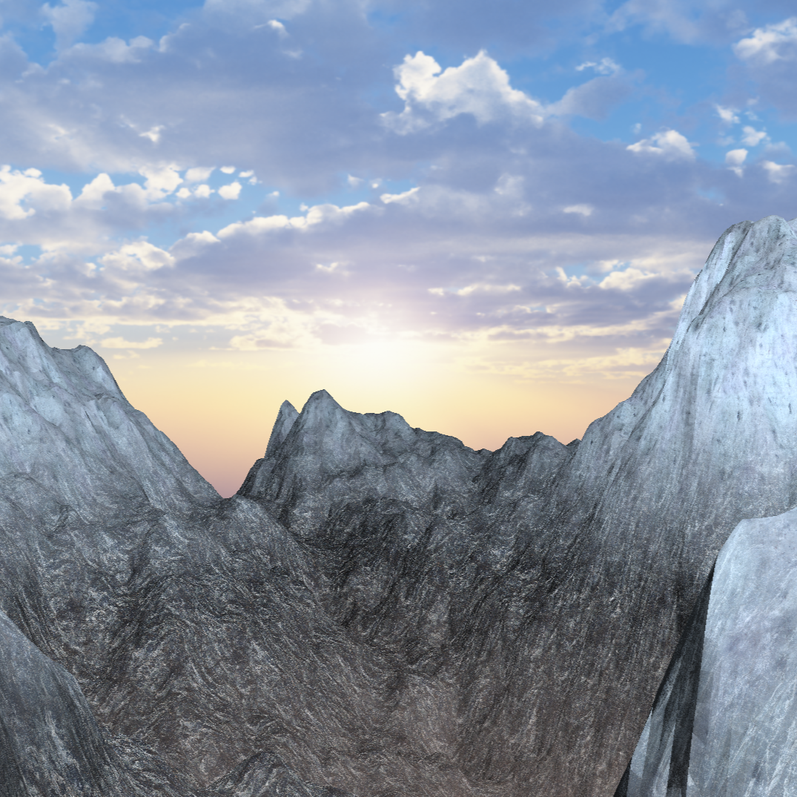
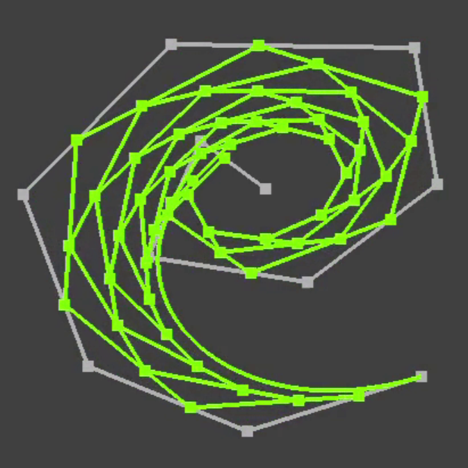
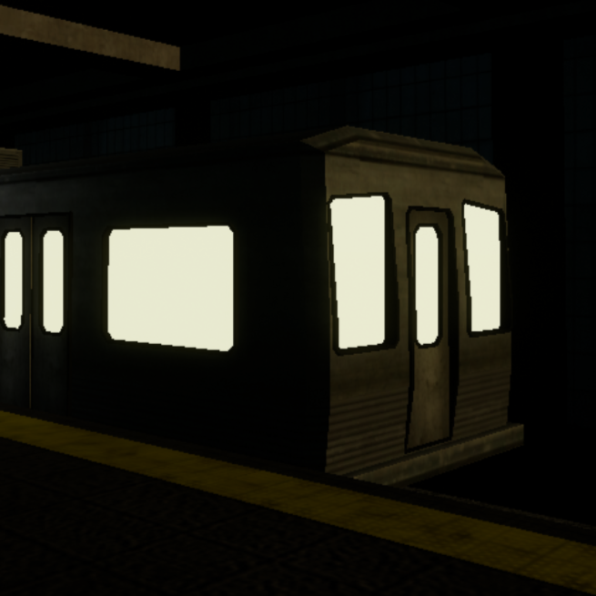

# BARZOIUS

**`C++ enthusiast 🛠`**
                                                                    
Barzoius is just a nickname, my real name is Rareș.                            
Not much to say yet, I like C++, graphics and physics.                           
               
   
---

| | | | |
|---|---|---|---|
|  |  |  |  |

| | | | |
|---|---|---|---|
|  |  | | |

