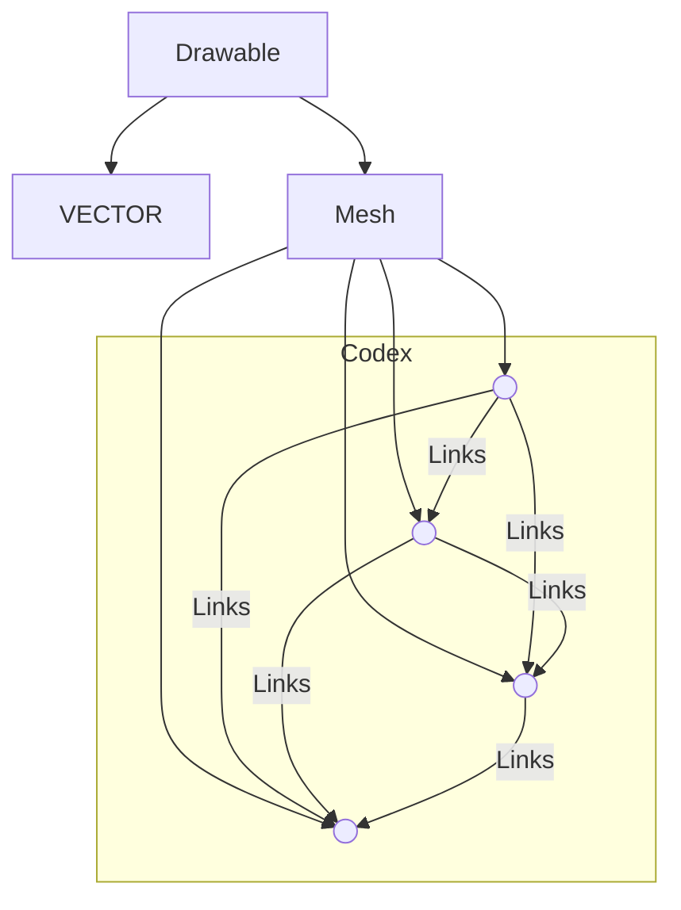

# BARZOIUS

**`C++ enthusiast 🛠`**
                                                                    
Barzoius is just a nickname, my real name is Rareș.                            
Not much to say yet, I like C++, graphics and physics.                           
               
   

      
   
---
   ###  Things I am learning:
 

    
    
    

   

  
   

